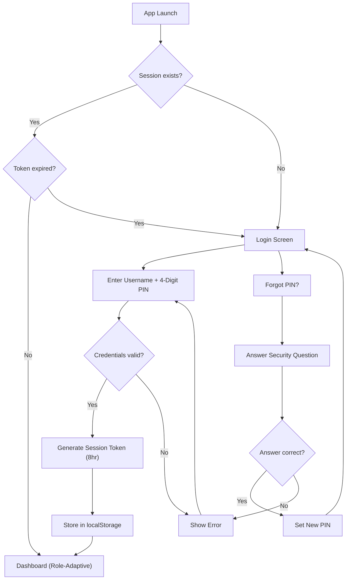
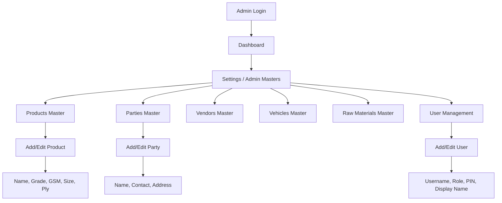
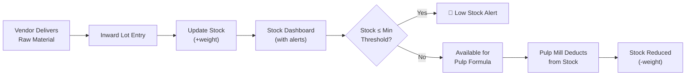
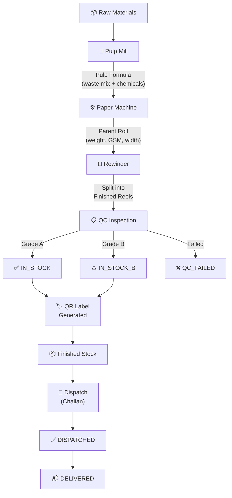
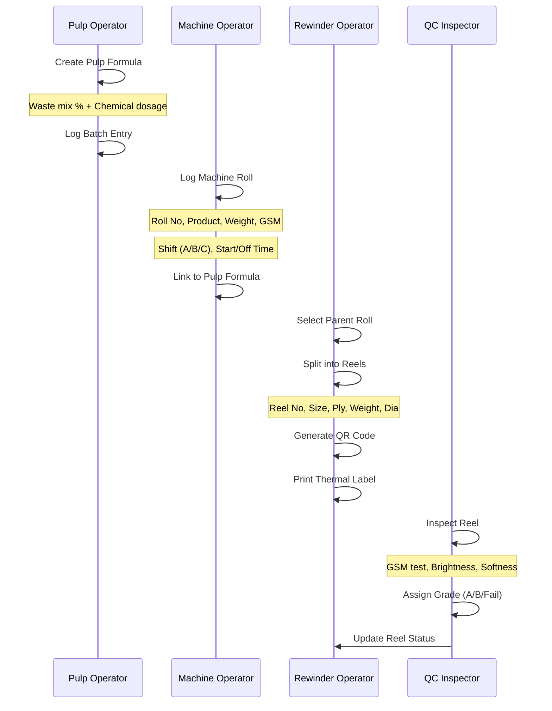
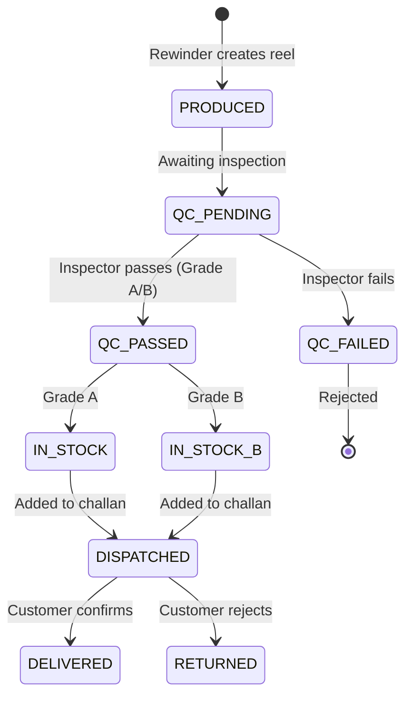
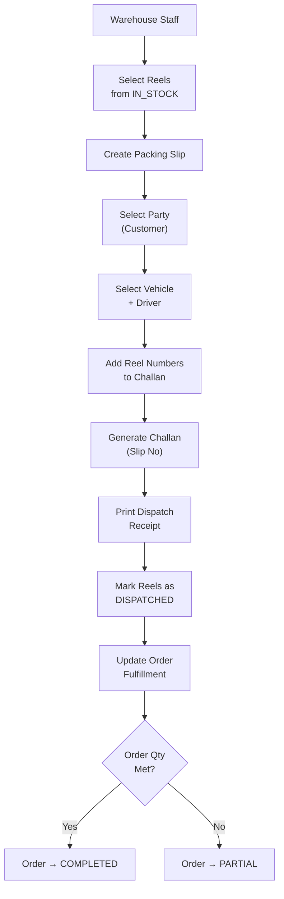
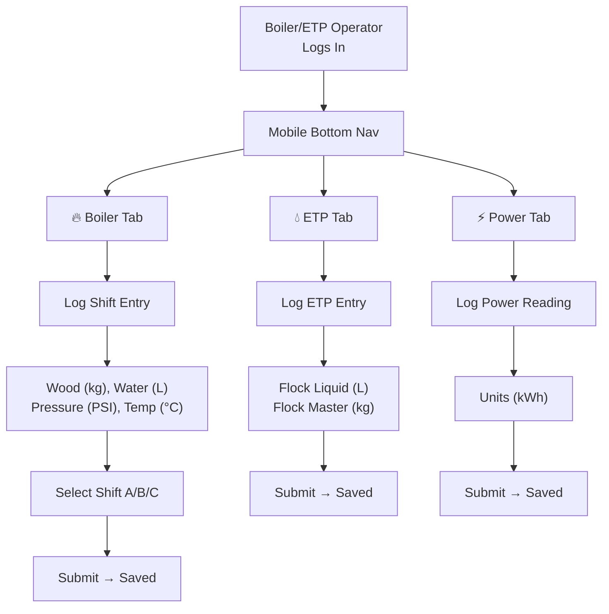
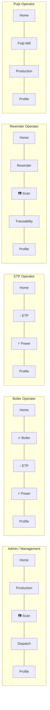
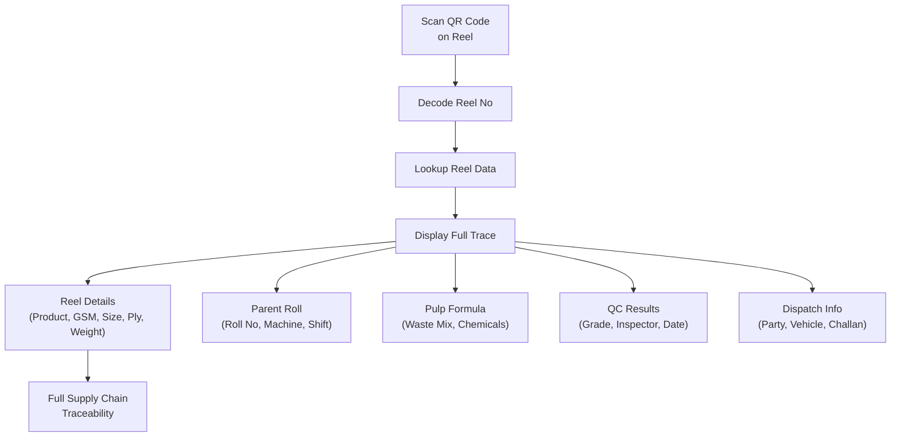

# Saheb Paper Pvt. Ltd. — ERP System
## Application Flow Document

**Version**: 2.0  
**Last Updated**: 2026-08-03

---

## 1. Authentication Flow

---

## 2. Admin Master Data Flow

---

## 3. Raw Material Lifecycle

---

## 4. Production Pipeline (End-to-End)

---

## 5. Pulp Mill → Machine → Rewinder Detail

---

## 6. QC Inspection Flow

---

## 7. Dispatch & Challan Flow

---

## 8. Utilities Operator Flow (Boiler / ETP / Electricity)

---

## 9. Mobile Bottom Navigation (Role-Specific)

---

## 10. QR Traceability Flow

