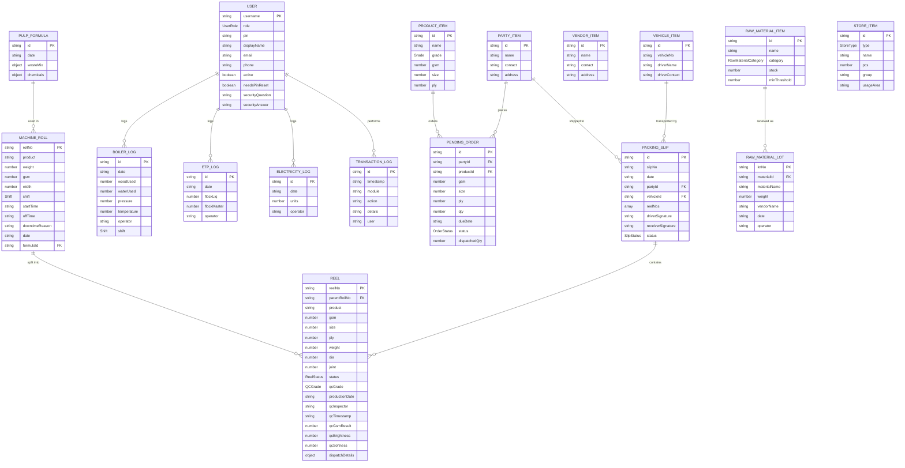

# Saheb Paper Pvt. Ltd. — ERP System
## Backend Data Schema

**Version**: 2.0  
**Last Updated**: 2026-08-03  
**Storage Engine**: localStorage (client-side)  
**Schema Language**: TypeScript interfaces

---

## 1. Entity Relationship Diagram (ERD)



---

## 2. Entity Definitions

### 2.1 User
```typescript
type UserRole =
  | 'Admin'
  | 'PulpOperator'
  | 'MachineOperator'
  | 'RewinderOperator'
  | 'BoilerOperator'
  | 'WarehouseStaff'
  | 'StoreManager'
  | 'EtpOperator'
  | 'Management';

interface User {
  username: string;        // PK — unique login identifier
  role: UserRole;          // Determines access permissions
  pin: string;             // 4-digit PIN for authentication
  displayName: string;     // Human-readable name
  email: string;           // Contact email
  phone: string;           // Contact phone
  active?: boolean;        // Account active/disabled flag
  needsPinReset?: boolean; // Force PIN change on next login
  securityQuestion?: string; // For PIN recovery
  securityAnswer?: string;   // Answer for recovery
}
```

### 2.2 Raw Material Item
```typescript
type RawMaterialCategory =
  | 'WASTE_PAPER'          // Indian Tissue Waste, Imported Tissue Waste
  | 'OTHER_RAW_MATERIAL'   // SMK, Cupstock, Pulp Sheet, Broke
  | 'CHEMICAL'             // DSR, Sizing Chemical
  | 'FIREWOOD';            // Boiler fuel wood

interface RawMaterialItem {
  id: string;              // PK — unique ID (e.g., "rm-1")
  name: string;            // Material name
  category: RawMaterialCategory;
  stock: number;           // Current stock in kg
  minThreshold: number;    // Alert threshold in kg
}
```

### 2.3 Product Item
```typescript
interface ProductItem {
  id: string;              // PK — unique ID
  name: string;            // e.g., "Napkin Tissue", "Toilet Tissue"
  grade: 'A' | 'B';       // Quality grade
  gsm: number;             // Grams per square meter
  size: number;            // Width in cm
  ply: number;             // Number of layers
}
```

### 2.4 Party Item (Customer)
```typescript
interface PartyItem {
  id: string;              // PK
  name: string;            // Customer/buyer name
  contact: string;         // Phone number
  address: string;         // Delivery address
}
```

### 2.5 Vendor Item (Supplier)
```typescript
interface VendorItem {
  id: string;              // PK
  name: string;            // Supplier name
  contact: string;         // Phone number
  address: string;         // Supplier address
}
```

### 2.6 Vehicle Item
```typescript
interface VehicleItem {
  id: string;              // PK
  vehicleNo: string;       // License plate (e.g., "GJ-05-XX-1234")
  driverName: string;      // Driver name
  driverContact: string;   // Driver phone
}
```

### 2.7 Pulp Formula
```typescript
interface PulpFormula {
  id: string;              // PK
  date: string;            // YYYY-MM-DD
  wasteMix: {              // Percentage breakdown
    [materialName: string]: number;  // e.g., { "Indian Tissue Waste": 50, "SMK": 20 }
  };
  chemicals: {             // Chemical dosage per ton of pulp
    [chemicalName: string]: number;  // e.g., { "DSR": 10 }
  };
}
```

### 2.8 Machine Roll (Parent Roll)
```typescript
interface MachineRoll {
  rollNo: string;          // PK — unique roll number
  product: string;         // Product name reference
  weight: number;          // Roll weight in kg
  gsm: number;             // Grams per square meter
  width: number;           // Roll width in mm
  shift: 'A' | 'B' | 'C'; // Production shift
  startTime: string;       // Shift start time (HH:MM)
  offTime: string;         // Shift end time (HH:MM)
  downtimeReason: string;  // Reason for any downtime
  date: string;            // YYYY-MM-DD
  formulaId: string;       // FK → PulpFormula.id
}
```

### 2.9 Reel (Finished Product)
```typescript
type ReelStatus =
  | 'PRODUCED'    // Just created by rewinder
  | 'QC_PENDING'  // Awaiting quality inspection
  | 'QC_PASSED'   // Passed inspection
  | 'QC_FAILED'   // Failed inspection
  | 'IN_STOCK'    // Grade A, ready for dispatch
  | 'IN_STOCK_B'  // Grade B, ready for dispatch
  | 'DISPATCHED'  // Shipped to customer
  | 'DELIVERED'   // Confirmed delivery
  | 'RETURNED';   // Customer returned

type QCGrade = 'A' | 'B' | 'PENDING';

interface Reel {
  reelNo: string;          // PK — e.g., "SAHEB-R-20260725-0001"
  parentRollNo: string;    // FK → MachineRoll.rollNo
  product: string;         // Product name
  gsm: number;             // GSM specification
  size: number;            // Width in cm
  ply: number;             // Number of plies
  weight: number;          // Reel weight in kg
  dia: number;             // Reel diameter in mm
  joint: number;           // Number of joints
  status: ReelStatus;      // Current lifecycle status
  qcGrade: QCGrade;        // Quality grade assigned
  productionDate: string;  // YYYY-MM-DD HH:MM
  qcInspector?: string;    // Inspector username
  qcTimestamp?: string;    // ISO timestamp of inspection
  qcGsmResult?: number;    // Measured GSM
  qcBrightness?: number;   // Brightness score
  qcSoftness?: number;     // Softness score
  dispatchDetails?: {      // Populated on dispatch
    partyName: string;
    vehicleNo: string;
    orderRef?: string;
    dispatchDate: string;
    packingSlipNo?: string;
  };
}
```

### 2.10 Boiler Log
```typescript
interface BoilerLog {
  id: string;              // PK
  date: string;            // YYYY-MM-DD
  woodUsed: number;        // Fuel wood consumed in kg
  waterUsed: number;       // Water consumed in liters
  pressure: number;        // Steam pressure in PSI
  temperature: number;     // Boiler temperature in °C
  operator: string;        // Operator username
  shift: 'A' | 'B' | 'C'; // Shift identifier
}
```

### 2.11 ETP Log
```typescript
interface EtpLog {
  id: string;              // PK
  date: string;            // YYYY-MM-DD
  flockLiq: number;        // Flock liquid used in liters
  flockMaster: number;     // Flock master used in kg
  operator: string;        // Operator username
}
```

### 2.12 Electricity Log
```typescript
interface ElectricityLog {
  id: string;              // PK
  date: string;            // YYYY-MM-DD
  units: number;           // Power consumed in kWh
  operator: string;        // Operator username
}
```

### 2.13 Pending Order
```typescript
interface PendingOrder {
  id: string;              // PK
  partyId: string;         // FK → PartyItem.id
  productId: string;       // FK → ProductItem.id
  gsm: number;             // Ordered GSM spec
  size: number;            // Ordered size spec
  ply: number;             // Ordered ply spec
  qty: number;             // Quantity of reels ordered
  dueDate: string;         // YYYY-MM-DD
  status: 'PENDING' | 'PARTIAL' | 'COMPLETED';
  dispatchedQty: number;   // Reels dispatched so far
}
```

### 2.14 Packing Slip (Dispatch Challan)
```typescript
interface PackingSlip {
  id: string;              // PK
  slipNo: string;          // Human-readable challan number
  date: string;            // YYYY-MM-DD
  partyId: string;         // FK → PartyItem.id
  vehicleId: string;       // FK → VehicleItem.id
  reelNos: string[];       // FK[] → Reel.reelNo
  driverSignature: string; // Digital signature (base64)
  receiverSignature: string;
  status: 'DRAFT' | 'DISPATCHED';
}
```

### 2.15 Store Item (Spare Parts)
```typescript
interface StoreItem {
  id: string;              // PK
  type: 'BEARING' | 'V_BELT';
  name: string;            // Bearing number or V-belt size
  pcs: number;             // Current stock count
  group?: string;          // V-belt group (A, B, C)
  usageArea?: string;      // Bearing usage area (e.g., "Paper Machine")
}
```

### 2.16 Raw Material Lot
```typescript
interface RawMaterialLot {
  lotNo: string;           // PK — unique lot number
  materialId: string;      // FK → RawMaterialItem.id
  materialName: string;    // Denormalized material name
  weight: number;          // Lot weight in kg
  vendorName: string;      // Supplier name
  date: string;            // YYYY-MM-DD
  operator: string;        // Staff who received
}
```

### 2.17 Transaction Log (Audit Trail)
```typescript
interface TransactionLog {
  id: string;              // PK
  timestamp: string;       // ISO 8601 string
  module: string;          // e.g., "Auth", "Raw Material", "Machine"
  action: string;          // e.g., "Login", "Deduction", "QC_Pass"
  details: string;         // Human-readable description
  user: string;            // Username who performed action
}
```

---

## 3. localStorage Key Map

| Key | Entity | Default Count |
|---|---|---|
| `saheb_users` | User[] | 9 seed users |
| `saheb_raw_materials` | RawMaterialItem[] | 10 materials |
| `saheb_products` | ProductItem[] | 6 products |
| `saheb_parties` | PartyItem[] | 5 customers |
| `saheb_vendors` | VendorItem[] | 3 vendors |
| `saheb_vehicles` | VehicleItem[] | 3 vehicles |
| `saheb_formulas` | PulpFormula[] | 2 formulas |
| `saheb_rolls` | MachineRoll[] | 10 rolls |
| `saheb_reels` | Reel[] | 20 reels |
| `saheb_logs` | TransactionLog[] | 5 seed logs |
| `saheb_boiler_logs` | BoilerLog[] | 7 logs |
| `saheb_etp_logs` | EtpLog[] | 7 logs |
| `saheb_electricity_logs` | ElectricityLog[] | 7 logs |
| `saheb_pending_orders` | PendingOrder[] | 4 orders |
| `saheb_packing_slips` | PackingSlip[] | 3 slips |
| `saheb_store_items` | StoreItem[] | 8 items |
| `saheb_raw_material_lots` | RawMaterialLot[] | 0 (user-created) |
| `saheb_session` | SessionData | 1 (active session) |
| `saheb_theme` | string | "light" |

---

## 4. Future Migration Path (v3.0)

> [!NOTE]
> The current localStorage schema maps 1:1 to a relational database. When migrating to a backend:

| Current (localStorage) | Future (PostgreSQL / Supabase) |
|---|---|
| `saheb_users` | `users` table with bcrypt PIN hashing |
| `saheb_reels` | `reels` table with FK constraints |
| `saheb_rolls` | `machine_rolls` table |
| `saheb_session` | JWT tokens with refresh rotation |
| `TransactionLog` | `audit_log` table with row-level security |
| All `getJSON/setJSON` calls | Supabase client SDK queries |
