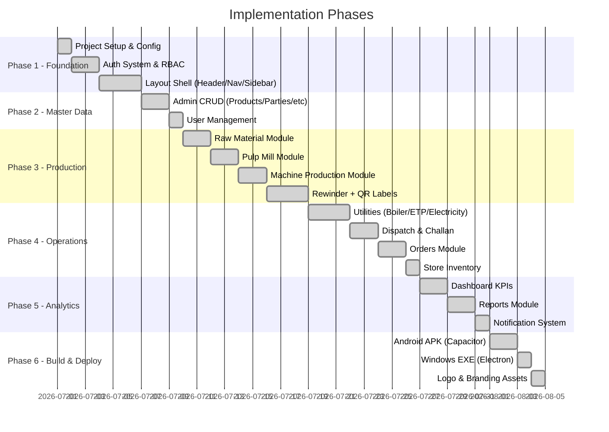

# Saheb Paper Pvt. Ltd. — ERP System
## Full Implementation Plan

**Version**: 2.0  
**Last Updated**: 2026-08-03  
**Status**: ✅ Production Complete

---

## Implementation Overview



---

## Phase 1: Foundation

### 1.1 Project Setup
```bash
npx -y create-vite@latest ./ --template react-ts
npm install react-router-dom@7 i18next react-i18next lucide-react qrcode.react recharts
npm install -D tailwindcss@4 @tailwindcss/vite
```

**Files Created:**
| File | Purpose |
|---|---|
| `vite.config.ts` | Vite config: port 5176, host: true, Tailwind plugin |
| `tailwind.config.ts` | Tailwind 4 configuration with custom theme tokens |
| `tsconfig.json` | TypeScript strict mode config |
| `src/index.css` | Global styles, CSS custom properties, print styles |
| `src/main.tsx` | React entry point |
| `src/i18n.ts` | i18next setup with EN/HI/GU translations |

### 1.2 Authentication System

**Files:**
| File | Purpose |
|---|---|
| `src/data/types.ts` | All TypeScript interfaces (User, Reel, etc.) |
| `src/data/index.ts` | Data access layer with seed data + localStorage CRUD |
| `src/modules/auth/AuthContext.tsx` | Auth provider: login, logout, RBAC, session management |
| `src/modules/auth/LoginView.tsx` | PIN-based login form with logo, forgot PIN flow |
| `src/modules/auth/ProtectedRoute.tsx` | Route guard checking auth + module permissions |

**Key Implementation Details:**
- 9 `UserRole` types with `ROLE_PERMISSIONS` mapping
- 8-hour session expiry with `SessionData` in localStorage
- Security question/answer for PIN reset

### 1.3 Layout Shell

**Files:**
| File | Purpose |
|---|---|
| `src/components/Layout.tsx` | Master layout: header, sidebar, bottom nav, mobile drawer |
| `src/components/CustomDatePickerModal.tsx` | 3-level date picker (Days → Months → Years) |
| `src/context/DateFilterContext.tsx` | Global date/timeframe filter state |

**Key Implementation Details:**
- Auto-hide header/bottom nav on scroll down, show on scroll up
- 9 role-specific bottom nav configurations
- Glassmorphic header with backdrop-blur
- Desktop sidebar with categorized nav sections
- Mobile slide-out drawer menu

---

## Phase 2: Master Data

### 2.1 Admin Masters

**Files:**
| File | Purpose |
|---|---|
| `src/modules/admin/AdminMasters.tsx` | Tab-based master data CRUD (Products, Parties, Vendors, Vehicles, Raw Materials) |
| `src/modules/admin/UserManagementView.tsx` | Create/edit users, assign roles, manage PINs |

**Key Implementation Details:**
- Each master has inline add/edit form + data table
- Real-time localStorage persistence
- Admin-only access (RBAC enforced)

---

## Phase 3: Production Pipeline

### 3.1 Raw Material Module

**Files:**
| File | Purpose |
|---|---|
| `src/modules/raw-material/RawMaterialView.tsx` | Stock dashboard, inward lot entry, stock adjustments |

**Features:**
- 4-category inventory view (Waste Paper, Other, Chemical, Firewood)
- Inward lot logging with vendor/weight/date
- Min-threshold alert integration

### 3.2 Pulp Mill Module

**Files:**
| File | Purpose |
|---|---|
| `src/modules/pulp-mill/PulpMillView.tsx` | Pulp formula builder, batch logging |

**Features:**
- Recipe builder with waste mix percentages + chemical dosages
- Links to raw material stock deductions
- Formula reference for machine rolls

### 3.3 Machine Production Module

**Files:**
| File | Purpose |
|---|---|
| `src/modules/machine/MachineView.tsx` | Parent roll entry form, shift logging |

**Features:**
- Roll number generation
- Shift-based entry (A/B/C) with timing
- Downtime reason tracking
- Links rolls to pulp formulas

### 3.4 Rewinder Module + QR

**Files:**
| File | Purpose |
|---|---|
| `src/modules/rewinder/RewinderView.tsx` | Reel entry, QC workflow, QR label generation |
| `src/modules/rewinder/RewindingReelConversionView.tsx` | Parent wrapper for rewinder |
| `src/modules/rewinder/QRScannerView.tsx` | Camera-based QR code scanning |
| `src/modules/rewinder/QRTraceabilityView.tsx` | Full reel traceability lookup |

**Features:**
- Parent roll → finished reel conversion
- QC inspection: Grade A/B/Fail with measurements
- QR code generation per reel (qrcode.react)
- Thermal label printing (TSC 4×3, 3×2, 2×2 + A4 grid)
- Camera QR scanner (html5-qrcode)
- Full supply chain traceability display

---

## Phase 4: Operations

### 4.1 Utilities Module (Boiler / ETP / Electricity)

**Files:**
| File | Purpose |
|---|---|
| `src/modules/boiler/UtilitiesEtpView.tsx` | Tab container with URL query param sync |
| `src/modules/boiler/BoilerView.tsx` | Boiler shift data entry form + log history |
| `src/modules/etp/EtpView.tsx` | ETP chemical dosing form + log history |
| `src/modules/etp/EtpElectricityLogsView.tsx` | Combined ETP+Electricity logs view |
| `src/modules/electricity/ElectricityView.tsx` | Power consumption entry + log history |

**Key Implementation Details:**
- **UtilitiesEtpView** reads `?tab=boiler|etp|electricity` from URL
- **Mobile bottom nav** (Layout.tsx):
  - BoilerOperator: 5 tabs — Home, 🔥Boiler, 💧ETP, ⚡Power, Profile
  - EtpOperator: 4 tabs — Home, 💧ETP, ⚡Power, Profile
- Desktop: unchanged (tabs remain inside the page as before)
- Each sub-view has its own accent color (orange/teal/amber)
- View More pagination with 6-item expand/collapse

### 4.2 Dispatch & Stock Module

**Files:**
| File | Purpose |
|---|---|
| `src/modules/dispatch/FinishedStockDispatchView.tsx` | Wrapper for dispatch |
| `src/modules/dispatch/DispatchView.tsx` | Reel inventory, challan creation, printable receipts |
| `src/modules/finish-stock/FinishStockView.tsx` | Finished stock overview |

**Features:**
- Reel status filtering (IN_STOCK, DISPATCHED, etc.)
- Packing slip creation with party/vehicle/driver selection
- Printable A4 challan receipts
- Order fulfillment tracking

### 4.3 Orders Module

**Files:**
| File | Purpose |
|---|---|
| `src/modules/orders/OrdersView.tsx` | Order CRUD, status tracking, due date alerts |

**Features:**
- Party-wise order management
- Product spec matching (GSM/size/ply)
- Status: PENDING → PARTIAL → COMPLETED
- Approaching-deadline notifications

### 4.4 Store Inventory

**Files:**
| File | Purpose |
|---|---|
| `src/modules/store/StoreView.tsx` | Bearing + V-belt inventory management |

**Features:**
- Bearing inventory by number and usage area
- V-belt inventory by size group (A, B, C)
- Stock in/out tracking

---

## Phase 5: Analytics & Intelligence

### 5.1 Dashboard

**Files:**
| File | Purpose |
|---|---|
| `src/modules/dashboard/DashboardView.tsx` | Role-adaptive KPI dashboard |

**Features:**
- Admin sees: Total production, dispatch, QC stats, revenue indicators
- Operators see: Department-specific KPIs only
- Date-range filtering (Day/Week/Month/All) with date stepper
- Live telemetry cards for Boiler/ETP operators (pH, TDS, BOD/COD)

### 5.2 Reports

**Files:**
| File | Purpose |
|---|---|
| `src/modules/reports/ReportsView.tsx` | Monthly/yearly report generation |

**Features:**
- Department-wise filterable reports
- Data tables with print support
- Summary calculations

### 5.3 Notification System

**Implementation:** Built into `Layout.tsx` (no separate module)

**Alert Types:**
| Alert | Trigger | Audience |
|---|---|---|
| Low Stock | `material.stock ≤ material.minThreshold` | Admin, raw_material_stock access |
| QC Backlog | Reel QC_PENDING > 24 hours | Admin, machine/rewinder access |
| Order Due | Order due date within 3 days | Admin, dispatch access |

---

## Phase 6: Build & Deploy

### 6.1 Android APK (Capacitor)

```bash
npm install @capacitor/core @capacitor/cli @capacitor/android
npx cap init "SahebPaper" "com.sahebpaper.erp"
npx cap add android
```

**Configuration Files:**
| File | Purpose |
|---|---|
| `capacitor.config.ts` | App ID, name, web dir |
| `android/gradle.properties` | JDK 21 path override |
| `android/gradlew.bat` | JAVA_HOME hardcoded to Android Studio JBR |
| `android/local.properties` | Android SDK path |
| `android/app/build.gradle` | Version code/name, min/target SDK |
| `android/app/src/main/res/` | Launcher icons (all densities) |

**Build Command:**
```bash
npm run build && npx cap sync android
cd android && gradlew.bat assembleDebug
# Copy output: android/app/build/outputs/apk/debug/app-debug.apk → SahebPaper.apk
```

### 6.2 Windows EXE (Electron)

**Configuration Files:**
| File | Purpose |
|---|---|
| `electron.cjs` | Electron main process (loads dist/index.html) |
| `package.json` | electron-builder config |
| `build/icon.png` | App icon for Windows |

**Build Command:**
```bash
npm run build
npx electron-builder --win portable
# Output: release/SahebPaper 0.0.0.exe → SahebPaper.exe
```

### 6.3 Branding Assets

| Asset | Source | Destinations |
|---|---|---|
| `saheb_logo.png` | `C:\Users\thako\Downloads\saheb_logo.png` | `public/logo.png`, `src/assets/logo.png`, `build/icon.png`, all `mipmap-*dpi` |
| Adaptive Icons | Generated from logo | `mipmap-anydpi-v26/ic_launcher.xml` (white bg + logo foreground) |

---

## File Registry (Complete)

| # | File Path | Lines | Purpose |
|---|---|---|---|
| 1 | `src/App.tsx` | 237 | Root routes |
| 2 | `src/main.tsx` | ~10 | Entry point |
| 3 | `src/index.css` | 206 | Global + print styles |
| 4 | `src/i18n.ts` | ~80 | i18next config |
| 5 | `src/data/types.ts` | 209 | TypeScript interfaces |
| 6 | `src/data/index.ts` | 1167 | Data layer + seeds |
| 7 | `src/components/Layout.tsx` | ~1418 | Layout shell |
| 8 | `src/components/CustomDatePickerModal.tsx` | ~200 | Date picker |
| 9 | `src/context/DateFilterContext.tsx` | ~60 | Date context |
| 10 | `src/modules/auth/AuthContext.tsx` | 217 | Auth + RBAC |
| 11 | `src/modules/auth/LoginView.tsx` | ~350 | Login screen |
| 12 | `src/modules/auth/ProtectedRoute.tsx` | ~25 | Route guard |
| 13 | `src/modules/dashboard/DashboardView.tsx` | ~600 | Dashboard |
| 14 | `src/modules/admin/AdminMasters.tsx` | ~800 | Admin CRUD |
| 15 | `src/modules/admin/UserManagementView.tsx` | ~400 | User mgmt |
| 16 | `src/modules/raw-material/RawMaterialView.tsx` | ~500 | Raw materials |
| 17 | `src/modules/pulp-mill/PulpMillView.tsx` | ~400 | Pulp mill |
| 18 | `src/modules/machine/MachineView.tsx` | ~500 | Machine prod |
| 19 | `src/modules/rewinder/RewinderView.tsx` | 632 | Rewinder + QR |
| 20 | `src/modules/rewinder/QRScannerView.tsx` | ~200 | QR scanner |
| 21 | `src/modules/rewinder/QRTraceabilityView.tsx` | ~300 | Traceability |
| 22 | `src/modules/boiler/UtilitiesEtpView.tsx` | ~112 | Tab container |
| 23 | `src/modules/boiler/BoilerView.tsx` | 540 | Boiler view |
| 24 | `src/modules/etp/EtpView.tsx` | ~500 | ETP view |
| 25 | `src/modules/electricity/ElectricityView.tsx` | ~400 | Electricity |
| 26 | `src/modules/dispatch/DispatchView.tsx` | 1099 | Dispatch |
| 27 | `src/modules/orders/OrdersView.tsx` | ~600 | Orders |
| 28 | `src/modules/store/StoreView.tsx` | ~400 | Store |
| 29 | `src/modules/reports/ReportsView.tsx` | ~900 | Reports |
| 30 | `src/modules/profile/OperatorProfileView.tsx` | ~300 | Op profile |
| 31 | `src/modules/profile/AdminProfileView.tsx` | ~300 | Admin profile |

---

## Verification Checklist

- [x] All 9 user roles can login with correct PIN
- [x] RBAC prevents unauthorized module access
- [x] All CRUD operations persist to localStorage
- [x] QR codes generate and scan correctly
- [x] Thermal labels print at correct sizes
- [x] Dispatch challans print on A4
- [x] Dark mode toggles cleanly
- [x] 3 languages (EN/HI/GU) work
- [x] Mobile bottom nav is role-specific
- [x] Boiler/ETP/Electricity are separate bottom tabs (mobile)
- [x] Desktop sidebar unchanged
- [x] Android APK installs and runs
- [x] Windows EXE launches and runs
- [x] Logo displays on login, header, and app icons
