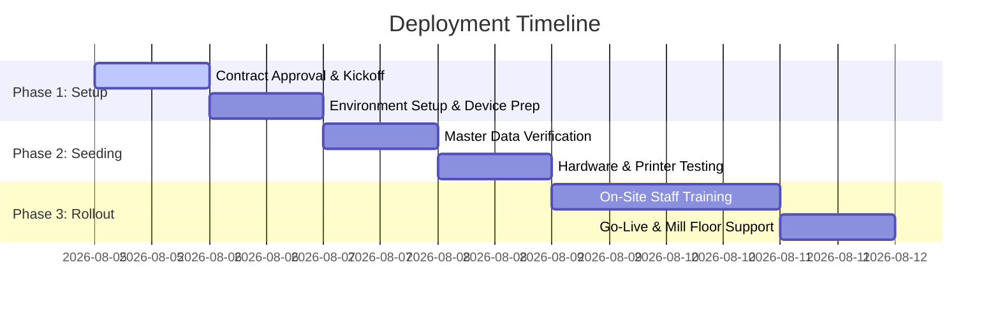

# COMMERCIAL PROPOSAL & INVESTMENT PLAN
## Full Digital Paper Mill ERP System for Saheb Paper Pvt. Ltd.

**Document Ref**: SP-ERP-PROP-2026-V1  
**Date**: August 4, 2026  
**Prepared For**: Management & Board, Saheb Paper Pvt. Ltd.  
**Prepared By**: Engineering & Enterprise Solutions Team  

---

## 1. Executive Summary

Saheb Paper Pvt. Ltd. is transitioning from legacy paper registers to a unified, mobile-first, enterprise-grade **Mill Operations & Supply Chain ERP**. 

This proposal outlines the commercial value, implementation costs, hardware investment options, and ongoing support terms for the **Saheb Paper ERP System** demonstrated today.

### Key Delivered Capabilities
- **End-to-End Paper Mill Lifecycle**: Raw Material → Pulp Mill → Machine Production → Rewinder → Finished Stock → Dispatch.
- **Utility & Environmental Control**: Live telemetry and shift logging for Boiler Steam, ETP Water Treatment, and Grid Electricity.
- **100% QR Traceability**: Automated QR label printing for every reel with complete parent-roll & pulp formula lineage.
- **Cross-Platform Readiness**: Native Windows Desktop App (`SahebPaper.exe`), Android Mobile App (`SahebPaper.apk`), and Web Cloud Portal.
- **Role-Based Workflows**: Custom mobile interfaces for 8 operator roles (Boiler, ETP, Machine, Rewinder, Pulp, Warehouse, Store, Admin, Management).

---

## 2. Solution Architecture & Value Valuation

If developed through a traditional custom software agency, a enterprise-grade multi-platform ERP of this scale entails substantial custom software engineering costs:

### Custom Development Valuation Breakdown

| Module / Component | Functional Scope | Market Agency Valuation |
|---|---|---|
| **Core Architecture & Design** | Glassmorphic UI/UX, Multi-language (EN/HI/GU), Dark Mode, Hash Routing | ₹1,20,000 |
| **Production Core** | Pulp Formula Engine, Machine Parent Roll Shift Log, Rewinder Conversion | ₹2,40,000 |
| **QR Traceability & Printing** | QR SVG generation, TSC Thermal Printer integration (4"×3", 3"×2", 2"×2", A4) | ₹95,000 |
| **Utilities & Telemetry** | Boiler fuel/steam, ETP chemical dosing, Electricity grid tracking | ₹1,10,000 |
| **Logistics & Dispatch** | Packing Slip generation, Vehicle & Customer masters, Printable Challans | ₹1,30,000 |
| **Role-Based Security** | 9-Role RBAC, 4-Digit PIN Auth, Auto Session Expiry, Audit Logs | ₹85,000 |
| **Multi-Platform Build** | Capacitor Android Native Build + Electron Windows Desktop Portable Build | ₹1,15,000 |
| **Total Estimated Custom Development Value** | | **₹8,95,000** |

---

## 3. Commercial Investment Packages

We offer flexible commercial packages tailored to Saheb Paper's rollout speed and budget:

```
┌─────────────────────────────────────────────────────────────────────────────────┐
│                           COMMERCIAL PRICING TIERS                              │
├──────────────────────────┬───────────────────────────┬──────────────────────────┤
│ PACKAGE A: ESSENTIAL     │ PACKAGE B: PROFESSIONAL   │ PACKAGE C: ENTERPRISE    │
│ (One-Time Turnkey)       │ (Recommended Turnkey)     │ (Turnkey + Cloud Sync)   │
├──────────────────────────┼───────────────────────────┼──────────────────────────┤
│ • Complete ERP Source    │ • Everything in Essential │ • Everything in Pro      │
│ • Web + Android + Win    │ • On-site Staff Training  │ • Cloud Backend (Supabase)│
│ • Local Device Deployment│ • Hardware Setup & Config │ • Multi-mill Sync        │
│ • 1 Month Free Support   │ • 3 Months Support        │ • 1 Year Premium AMC     │
├──────────────────────────┼───────────────────────────┼──────────────────────────┤
│  INVESTMENT: ₹1,25,000   │  INVESTMENT: ₹1,95,000    │  INVESTMENT: ₹3,50,000   │
└──────────────────────────┴───────────────────────────┴──────────────────────────┘
```

---

### Detailed Package Breakdown

#### Option A: Essential Turnkey Package — ₹1,25,000 *(One-Time)*
- Perpetual Software License for Saheb Paper Pvt. Ltd.
- Full local setup on existing office PC and Android phones.
- Windows Desktop Portable App (`.exe`) + Android Mobile Installation (`.apk`).
- Master data seeding (Products, Customers, Raw Materials, Vendors).
- **1 Month** post-deployment warranty and hypercare.

#### Option B: Professional Turnkey Package (Recommended) — ₹1,95,000 *(One-Time)*
- **Everything in Option A**, PLUS:
- **On-Site Installation & Configuration** for all mill desktop workstations and mobile devices.
- **3 Days Dedicated Operator Training** (Boiler, ETP, Machine, Rewinder, Warehouse teams).
- Custom mill logo & branding integration in launcher icons, splash screen, and print receipts.
- **3 Months Included Technical Support & Maintenance**.

#### Option C: Enterprise Cloud & Multi-Mill Package — ₹3,50,000 *(One-Time)*
- **Everything in Option B**, PLUS:
- Centralized Cloud Sync Integration (PostgreSQL / Supabase backend).
- Real-time multi-device cloud synchronization across mobile devices.
- Executive Owner Mobile App with live analytics anywhere in the world.
- **1 Year Full Annual Maintenance Contract (AMC)** included.

---

## 4. Hardware & Infrastructure Plan

To ensure seamless daily operations on the mill floor, the following hardware is recommended:

| Hardware Item | Purpose | Spec / Model | Estimated Qty | Cost per Unit | Total Est. Cost |
|---|---|---|---|---|---|
| **Thermal Label Printer** | Printing QR Reel Tags | TSC DA210 / DA220 Direct Thermal | 1 Unit | ₹14,500 | ₹14,500 |
| **Industrial Mobile Devices** | Operator Data Entry | Samsung Galaxy M15 / Redmi 13 (Rugged Case) | 3 Units | ₹11,000 | ₹33,000 |
| **Bluetooth / USB QR Scanner** | Dispatch Reel Verification | Eyoyo / Netum 2D Wireless Scanner | 1 Unit | ₹3,500 | ₹3,500 |
| **Thermal Roll Stickers** | QR Sticker Supplies | 4" x 3" Direct Thermal Paper Rolls (1000 labels/roll) | 10 Rolls | ₹450 | ₹4,500 |
| **Total Hardware Investment (Optional)** | | | | | **₹55,500** |

*Note: Hardware can be procured directly by Saheb Paper Pvt. Ltd. or supplied by us at actual cost.*

---

## 5. Annual Maintenance Contract (AMC) Terms

After the initial warranty period, an optional Annual Maintenance Contract (AMC) ensures zero mill downtime and continuous operational readiness:

### AMC Coverage — ₹25,000 / Year (Billable Year 2 Onwards)
- **Bug Fixes & Maintenance**: Priority resolution of operational or software bugs.
- **Minor Feature Enhancements**: Up to 4 minor field/report customization requests per year.
- **OS Compatibility Updates**: Updates for new Android versions & Windows releases.
- **Database Backup & Integrity Check**: Monthly system health checks and backup audits.
- **Dedicated Tech Support**: Phone & Remote (AnyDesk / TeamViewer) assistance within 4 hours.

---

## 6. Implementation & Delivery Roadmap

The entire deployment can be completed within **7 Business Days**:



---

## 7. Milestone Payment Schedule

| Milestone | Deliverable / Trigger | Percentage | Option B Amount |
|---|---|---|---|
| **Milestone 1: Project Kickoff** | Signing of Contract & Software Demonstration Approval | 40% | ₹78,000 |
| **Milestone 2: On-Site Setup** | Software installed on all Mill PCs, Printers & Mobiles | 40% | ₹78,000 |
| **Milestone 3: Final Go-Live** | Staff training completed & live reel QR printed | 20% | ₹39,000 |
| **Total Commercial Contract** | | **100%** | **₹1,95,000** |

---

## 8. Terms & Conditions

1. **Validity**: This proposal and pricing are valid for 30 days from August 4, 2026.
2. **IP Rights**: Saheb Paper Pvt. Ltd. retains full usage rights for their enterprise.
3. **Warranty**: 3 Months full warranty included in Option B & Option C.
4. **Taxes**: Applicable GST (18%) extra as per Government guidelines.

---

### Authorizations & Approval

**For Saheb Paper Pvt. Ltd.**

Name: ___________________________  
Designation: ____________________  
Signature: ______________________  
Date: ___________________________  

**For ERP Solutions Team**

Name: ___________________________  
Designation: Lead Architect  
Signature: ______________________  
Date: August 4, 2026  
