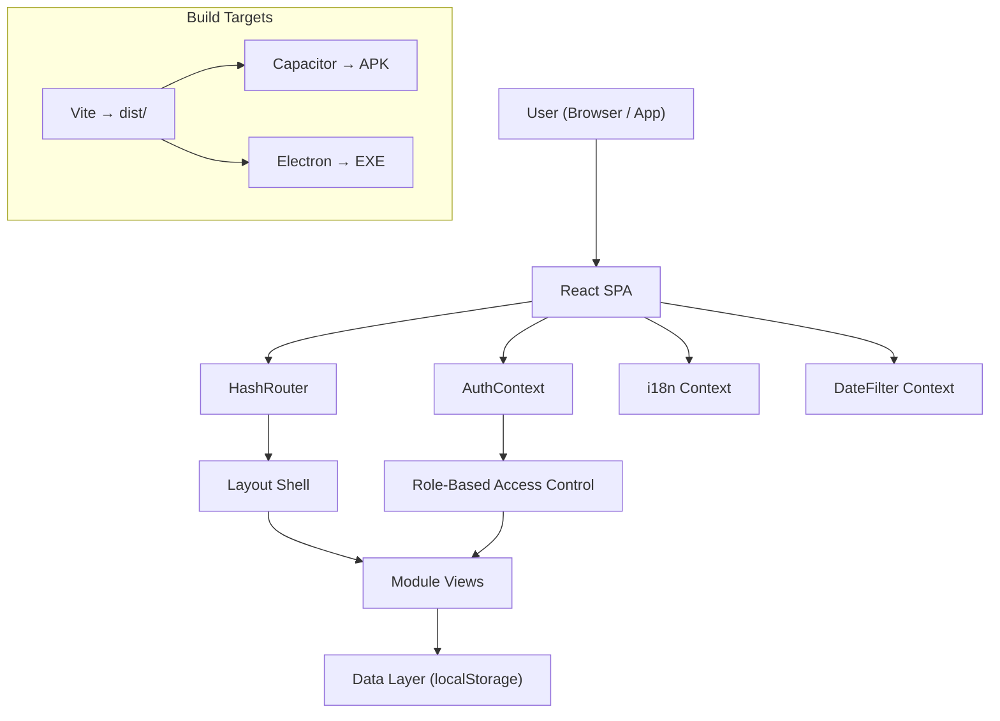

# Saheb Paper Pvt. Ltd. — ERP System
## Technical Requirements Document (TRD)

**Version**: 2.0  
**Last Updated**: 2026-08-03  
**Status**: Production

---

## 1. Technology Stack

| Layer | Technology | Version |
|---|---|---|
| **Language** | TypeScript | 5.x |
| **UI Framework** | React | 18.x |
| **Build Tool** | Vite | 8.x |
| **CSS Framework** | Tailwind CSS | 4.x (PostCSS plugin) |
| **Routing** | React Router DOM | 7.x (HashRouter) |
| **Internationalization** | i18next + react-i18next | 25.x |
| **QR Code Generation** | qrcode.react | 4.x |
| **QR Code Scanning** | html5-qrcode | 2.x |
| **Icons** | Lucide React | 0.5x |
| **Charts** | Recharts | 2.x |
| **Mobile (Android)** | Capacitor | 7.x |
| **Desktop (Windows)** | Electron + electron-builder | 35.x |
| **Font** | Inter (Google Fonts) | Variable |

---

## 2. Architecture Overview



### Architecture Pattern
- **Single Page Application (SPA)** with client-side routing via `HashRouter`
- **Module-based architecture**: Each domain (Boiler, ETP, Machine, etc.) is an isolated module under `src/modules/`
- **Context-based state management**: `AuthContext`, `DateFilterContext` for cross-cutting concerns
- **LocalStorage persistence**: All data stored in browser localStorage (offline-first)
- **No backend server**: Fully client-side application with seed data

---

## 3. Project Structure

```
saheb-paper-demo/
├── android/                     # Capacitor Android project
│   ├── app/
│   │   ├── build.gradle         # Android build config (versionCode, JDK)
│   │   └── src/main/
│   │       ├── AndroidManifest.xml
│   │       └── res/             # Launcher icons (mipmap-*dpi)
│   ├── gradle.properties        # org.gradle.java.home config
│   └── gradlew.bat              # JAVA_HOME override for JDK 21
├── build/                       # Electron build resources
│   └── icon.png                 # App icon for Electron
├── dist/                        # Vite production build output
├── public/
│   └── logo.png                 # Saheb Paper logo
├── src/
│   ├── App.tsx                  # Root routes definition
│   ├── main.tsx                 # React entry point
│   ├── index.css                # Global styles + print styles
│   ├── i18n.ts                  # i18next configuration
│   ├── assets/
│   │   └── logo.png             # In-app logo asset
│   ├── components/
│   │   ├── Layout.tsx           # Main shell (header, sidebar, bottom nav)
│   │   └── CustomDatePickerModal.tsx  # 3-level date picker (Days→Months→Years)
│   ├── context/
│   │   └── DateFilterContext.tsx # Global date/timeframe filter state
│   ├── data/
│   │   ├── types.ts             # TypeScript interfaces (User, Reel, BoilerLog, etc.)
│   │   └── index.ts             # Data access layer (localStorage CRUD + seed data)
│   └── modules/
│       ├── admin/               # AdminMasters, UserManagementView
│       ├── auth/                # AuthContext, LoginView, ProtectedRoute
│       ├── boiler/              # BoilerView, UtilitiesEtpView (tab container)
│       ├── dashboard/           # DashboardView (role-adaptive KPIs)
│       ├── dispatch/            # FinishedStockDispatchView, DispatchView
│       ├── electricity/         # ElectricityView
│       ├── etp/                 # EtpView, EtpElectricityLogsView
│       ├── finish-stock/        # FinishStockView
│       ├── machine/             # MachineView
│       ├── orders/              # OrdersView
│       ├── profile/             # OperatorProfileView, AdminProfileView
│       ├── pulp-mill/           # PulpMillView
│       ├── raw-material/        # RawMaterialView
│       ├── reports/             # ReportsView
│       ├── rewinder/            # RewinderView, QRScannerView, QRTraceabilityView
│       └── store/               # StoreView (bearings, V-belts)
├── capacitor.config.ts          # Capacitor configuration
├── electron.cjs                 # Electron main process
├── package.json                 # Dependencies & scripts
├── tailwind.config.ts           # Tailwind 4 configuration
├── tsconfig.json                # TypeScript configuration
└── vite.config.ts               # Vite dev server (port 5176, host: true)
```

---

## 4. Data Persistence Strategy

### Storage Engine: `localStorage`

All application data is persisted in the browser's `localStorage` using JSON serialization.

| Key | Data Type | Description |
|---|---|---|
| `saheb_users` | `User[]` | User accounts with roles & PINs |
| `saheb_raw_materials` | `RawMaterialItem[]` | Raw material inventory |
| `saheb_products` | `ProductItem[]` | Product catalog (Napkin, Toilet, etc.) |
| `saheb_parties` | `PartyItem[]` | Customer master |
| `saheb_vendors` | `VendorItem[]` | Vendor/supplier master |
| `saheb_vehicles` | `VehicleItem[]` | Vehicle + driver master |
| `saheb_formulas` | `PulpFormula[]` | Pulp batch recipes |
| `saheb_rolls` | `MachineRoll[]` | Parent rolls from machine |
| `saheb_reels` | `Reel[]` | Finished reels from rewinder |
| `saheb_logs` | `TransactionLog[]` | Audit trail log |
| `saheb_boiler_logs` | `BoilerLog[]` | Boiler shift entries |
| `saheb_etp_logs` | `EtpLog[]` | ETP chemical dosing logs |
| `saheb_electricity_logs` | `ElectricityLog[]` | Power consumption logs |
| `saheb_pending_orders` | `PendingOrder[]` | Customer orders |
| `saheb_packing_slips` | `PackingSlip[]` | Dispatch challans |
| `saheb_store_items` | `StoreItem[]` | Spare parts inventory |
| `saheb_raw_material_lots` | `RawMaterialLot[]` | Inward lot tracking |
| `saheb_session` | `SessionData` | Active user session token |
| `saheb_theme` | `string` | Dark/light theme preference |

### Data Access Pattern
```typescript
// Generic read/write helpers
const getJSON = <T>(key: string, defaultValue: T): T => { ... };
const setJSON = <T>(key: string, value: T): void => { ... };

// Module-specific CRUD functions exported from data/index.ts
export function getBoilerLogs(): BoilerLog[] { ... }
export function saveBoilerLog(log: BoilerLog): void { ... }
```

---

## 5. Security Model

### Authentication Flow
1. User enters **username** + **4-digit PIN** on login screen
2. System validates against `saheb_users` in localStorage
3. On success: generates session token with 8-hour expiry, stores in `saheb_session`
4. All protected routes check `AuthContext` for valid session
5. Session auto-expires after 8 hours; user redirected to login

### Role-Based Access Control (RBAC)
```typescript
const ROLE_PERMISSIONS: Record<UserRole, string[]> = {
  Admin: ['dashboard', 'raw_material_stock', 'pulp_mill_operations', ...all modules],
  BoilerOperator: ['dashboard', 'utilities_etp'],
  EtpOperator: ['dashboard', 'utilities_etp'],
  // ...etc
};
```

### PIN Security
- PINs stored as plaintext in localStorage (demo-grade; production would use bcrypt)
- Security question + answer for PIN reset flow
- PIN visibility toggle in profile editor

---

## 6. Routing Architecture

| Path | Module | Access |
|---|---|---|
| `/login` | LoginView | Public |
| `/` | DashboardView | All authenticated |
| `/profile` | ProfileRouteWrapper | All authenticated |
| `/qr-scanner` | QRScannerView | All authenticated |
| `/traceability` | QRTraceabilityView | All authenticated |
| `/raw-material-stock` | RawMaterialView | raw_material_stock |
| `/orders` | OrdersView | orders |
| `/pulp-mill-operations` | PulpMillView | pulp_mill_operations |
| `/machine-production` | MachineView | machine_production |
| `/rewinding-reel-conversion` | RewindingReelConversionView | rewinding_reel_conversion |
| `/utilities-etp` | UtilitiesEtpView | utilities_etp |
| `/utilities-etp?tab=boiler` | UtilitiesEtpView (Boiler tab) | utilities_etp |
| `/utilities-etp?tab=etp` | UtilitiesEtpView (ETP tab) | utilities_etp |
| `/utilities-etp?tab=electricity` | UtilitiesEtpView (Electricity tab) | utilities_etp |
| `/finished-stock-dispatch` | FinishedStockDispatchView | finished_stock_dispatch |
| `/spareparts-management` | StoreView | spareparts_management |
| `/monthly-yearly-reporting` | ReportsView | monthly_yearly_reporting |
| `/admin-panel-audit` | AdminMasters | admin_panel_audit |
| `/user-management` | UserManagementView | admin_panel_audit |

---

## 7. Build & Deployment

### Development
```bash
npm run dev          # Vite dev server on http://localhost:5176
```

### Production Web Build
```bash
npm run build        # TypeScript check + Vite production build → dist/
```

### Android APK
```bash
npx cap sync android                    # Sync web assets to Android project
cd android && gradlew.bat assembleDebug  # Build debug APK
# Output: android/app/build/outputs/apk/debug/app-debug.apk
```

### Windows EXE
```bash
npx electron-builder --win portable     # Build portable .exe
# Output: release/SahebPaper 0.0.0.exe
```

### Environment Requirements
| Tool | Required Version | Notes |
|---|---|---|
| Node.js | 18+ | LTS recommended |
| JDK | 17 or 21 | JDK 25 NOT supported by Gradle 8.14 |
| Android SDK | API 22+ (minSdk) | Android Studio JBR JDK 21 preferred |
| Gradle | 8.14 | Bundled via gradlew |

---

## 8. Third-Party Dependencies

| Package | Purpose | License |
|---|---|---|
| react, react-dom | UI framework | MIT |
| react-router-dom | Client-side routing | MIT |
| i18next, react-i18next | Internationalization | MIT |
| qrcode.react | QR code SVG generation | ISC |
| html5-qrcode | Camera-based QR scanning | Apache 2.0 |
| lucide-react | Icon library | ISC |
| recharts | Data visualization charts | MIT |
| @capacitor/core | Native mobile bridge | MIT |
| electron | Desktop app wrapper | MIT |
| tailwindcss | Utility-first CSS | MIT |
