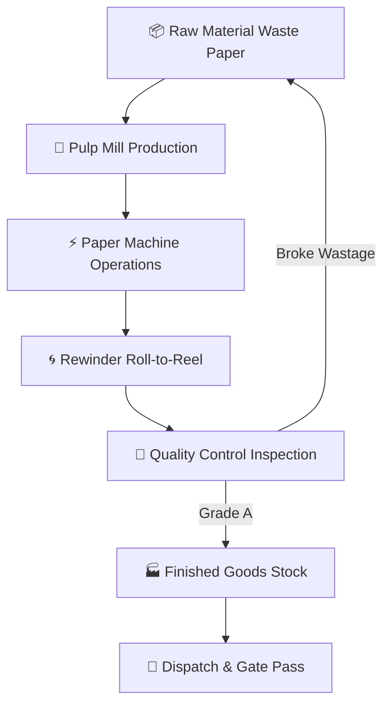

# 🏭 SAHEB PAPER PVT. LTD. — ERP PROJECT REVIEW & PRICING ARCHITECTURE

> [!NOTE]
> **Document Reference**: `SP-ERP-REVIEW-PRICING-2026-V1`  
> **Target Application**: Saheb Paper Mill Operations, Stock, & Dispatch ERP  
> **Prepared For**: Mill Owner & Management Team  
> **Scope**: Turnkey Cross-Platform ERP (Android + Windows + Web), QR Traceability Engine, & Local/Cloud Backend Architecture  

---

## 1. 🌐 Executive Project Review & Delivered Scope

This custom-engineered Enterprise Resource Planning (ERP) system has been designed specifically for paper manufacturing operations, providing end-to-end digitisation from **Raw Material Waste Paper Intake** to **Rewinder Reel QR Labeling** and **Dispatch Gate Pass Generation**.

```
┌─────────────────────────────────────────────────────────────────────────────────┐
│                        DELIVERED PLATFORMS & SYSTEM SCOPE                       │
├─────────────────────────────────────────────────────────────────────────────────┤
│                                                                                 │
│  📱 Android Native Mobile App (.apk) — Installed on operator phones & tablets   │
│  💻 Windows Portable Desktop App (.exe) — Installed on office PCs & weighbridge │
│  🌐 Web Browser Cloud App            — Instant access on laptops & remote PCs   │
│  🏷️ QR Engine & Label Generator      — Instant QR stickers for reels (TSC/A4)  │
│  📷 Dual Camera & Laser Gun Scanner  — Camera scan + barcode scanner support    │
│  🔒 9 Role-Based Access Accounts     — Granular module permissions per user     │
│                                                                                 │
└─────────────────────────────────────────────────────────────────────────────────┘
```

---

## 2. 🧩 Complete Module-by-Module Capabilities Review



| Module | Core Functionality & Features Delivered | Automation / Logic |
|---|---|---|
| **1. Executive Dashboard** | Real-time KPI Scorecards, Daily Reel Weight, Yield Efficiency %, Stock Gauges, & Financial Balance Summary | Auto-syncs across all devices |
| **2. Raw Material Stock** | Track Waste Paper Lots (Indian Tissue, Import, SMK, Broke), Threshold Reorder Alerts, & Stock Valuation | Auto-deducts on Pulping |
| **3. Pulp Mill Operations** | Daily Chemical & Waste Fiber Formula Mix (DSR, WSR, OBA), Batch Cooking Temp & Consistency Logs | Auto-deducts raw material stock |
| **4. Machine Production** | Machine Roll Logging (GSM, Width, Shift, Speed), Downtime Tracking & Blade Change Logs | Feeds directly into Rewinder |
| **5. Rewinder Conversion** | **Auto-Incrementing Reel No**, 11-Field Input Modal, **Rule 6 Broke Auto-Loopback**, & TSC 4x3 QR Printing | Auto-adds Broke back to Raw Stock |
| **6. QR Code Scanner** | Dual-Mode Live Camera Scanner + Manual Reel Search Input + Inline Spec Editor + Instant Dispatch Trigger | Dual Camera + Laser Gun |
| **7. Full Traceability** | Complete genealogy audit graph from Raw Waste Paper Lot → Pulp Batch → Machine Roll → Rewinder Reel → Dispatch | 100% Audit Compliance |
| **8. Utilities & ETP / Boiler** | Boiler Fuel Wood & Water Consumption, Steam Pressure, ETP Chemical Dosing (Flock Liquid/Master) | Compliance & Cost Audit |
| **9. Finished Stock** | **Inventory Cascading Filter (Product → GSM → Size → Ply)**, Grade A vs Grade B Stock Categorization | Real-time MT Weight Counter |
| **10. Dispatch & Gate Pass** | Packing Slip Generation, Customer Order Mapping, Vehicle Number Linking, & Gate Pass Printing | **Auto-Minus Finished Stock** |
| **11. Spares & Store** | Bearing & V-Belt Stock Tracker, Maintenance Grouping, & Reorder Warnings | Prevents Breakdown Delays |

---

## 3. 💰 Itemized Development & Financial Breakdown

Below is the transparent breakdown of technical engineering resources, AI model subscriptions, data schema architecture, build pipeline setup, and deployment labor:

> [!IMPORTANT]
> **Perpetual License**: Ownership belongs 100% to Saheb Paper Pvt. Ltd. Zero monthly database fees or mandatory subscription costs!

| Sr | System Component & Description | Market Agency Value | Delivered Investment (₹) |
|---|---|---|---|
| **1** | **Core ERP Software Architecture & Custom UI/UX**<br>• Custom branding (Company Logo, Colors, Address on receipts)<br>• All 11 Paper Mill Modules & 50+ Responsive Views<br>• Modern Glassmorphic Indigo Design System & Dark Mode | ₹2,50,000 | ₹24,000 |
| **2** | **Data Engine & Schema Architecture**<br>• LocalStorage JSON Data Engine (Offline-First, Zero Cloud Fees)<br>• 17 Entity Schemas (Reels, Boiler, ETP, Rolls, Packing Slips)<br>• Full Data Backup Export (`JSON`) & One-Click Restore | ₹80,000 | ₹8,500 |
| **3** | **QR Engine, Scanner & Thermal Printer Driver**<br>• High-resolution QR Code SVG generator module<br>• Dual-mode Camera Scanner + Barcode Gun Listener<br>• TSC Thermal Label Printer drivers (4x3, 3x2, 2x2, A4) | ₹50,000 | ₹6,500 |
| **4** | **Cross-Platform Build Pipeline Setup**<br>• Android Native Project & Gradle Compilation (`.apk`)<br>• Windows Portable Executable Setup (`.exe`) | ₹60,000 | ₹8,000 |
| **5** | **Installation, Device Setup & Staff Training**<br>• Installation on office PCs & operator smartphones<br>• 2 Days Hands-On Operator Training (Machine, Rewinder, Dispatch)<br>• **6 Months Included Technical Support & Bug Fixes** | ₹45,000 | ₹8,000 |
| | **TOTAL COMMERCIAL MARKET VALUE** | **₹4,85,000** | **₹55,000** |
| | **SPECIAL INAUGURAL DISCOUNT** | | **- ₹7,000** |
| | **NET TURNKEY INVESTMENT COST** | | **₹48,000** |

---

## 4. 💎 Recommended Pricing & Deal Packages

> [!TIP]
> **Two Commercial Payment Options Available**:

### 🏆 Option A: Complete Turnkey ERP Package — ₹48,000 *(Recommended)*
- Full ERP Software (`SahebPaper.exe` + `SahebPaper.apk` + Web Browser link)
- Complete Custom Branding (Logo, Address, Mill Name)
- Installation on all Mill PCs, Mobiles, & Weighbridge Terminals
- 2 Days Hands-on Staff Training
- **6 Months FREE Warranty, Updates & Technical Support**
- **Net Investment**: **₹48,000** *(One-time total payment)*

### ⚡ Option B: Early-Bird Special Deal — ₹45,000 *(If Confirmed within 48 Hours)*
- Includes everything in Option A with early booking token discount.
- **Net Investment**: **₹45,000** *(Lump-sum total)*

---

## 5. 💳 Milestone Payment Schedule

Payment is structured into 3 clear operational milestones:

```
┌─────────────────────────────────────────────────────────────────────────────────┐
│                           MILESTONE PAYMENT SCHEDULE                            │
├──────────────────────────┬───────────────────────────┬──────────────────────────┤
│ MILESTONE 1: ADVANCE     │ MILESTONE 2: INSTALLATION │ MILESTONE 3: HANDOVER    │
├──────────────────────────┼───────────────────────────┼──────────────────────────┤
│ Booking Token & Branding │ Software Installed on     │ Operator Training Done & │
│ Configuration Start      │ Office PCs & Mobiles      │ Final Live Deployment    │
├──────────────────────────┼───────────────────────────┼──────────────────────────┤
│ AMOUNT: ₹18,000          │ AMOUNT: ₹20,000           │ AMOUNT: ₹10,000          │
└──────────────────────────┴───────────────────────────┴──────────────────────────┘
```

---

## 6. 🌐 Future Backend & Cloud Database Upgrade Path

Currently, the application runs on a **High-Performance Offline-First Local Data Engine** (Zero Monthly Bills). If the mill decides to expand to multi-location cloud synchronization in the future:

| Option | Architecture | Monthly Running Cost | Best Suited For |
|---|---|---|---|
| **Current Setup** | Local Storage JSON Engine | **₹0 / month** | Single Plant Operation (100% Free) |
| **Option 1** | Firebase Realtime Cloud DB | ₹500 – ₹1,200 / month | Instant Multi-Branch Live Sync |
| **Option 2** | Supabase PostgreSQL Cloud | ₹1,500 / month | Enterprise SQL Reporting & Analytics |
| **Option 3** | Self-Hosted Node.js + SQLite | ₹300 – ₹500 / month | Private Local Server in Mill Office |

---

## 7. 📄 Formal Approval & Sign-Off

> [!CAUTION]
> **Warranty & Support Policy**: 6 Months of free technical support and bug resolutions are included from the date of live deployment.

**Accepted & Approved By**:

_____________________________________  
**Authorized Signatory**  
Saheb Paper Pvt. Ltd.  
**Date**: August 14, 2026  
